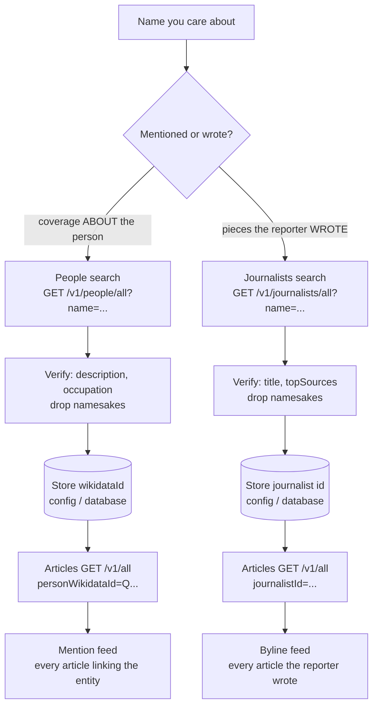
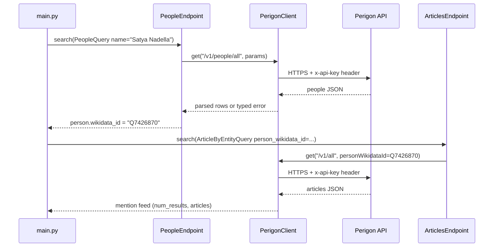
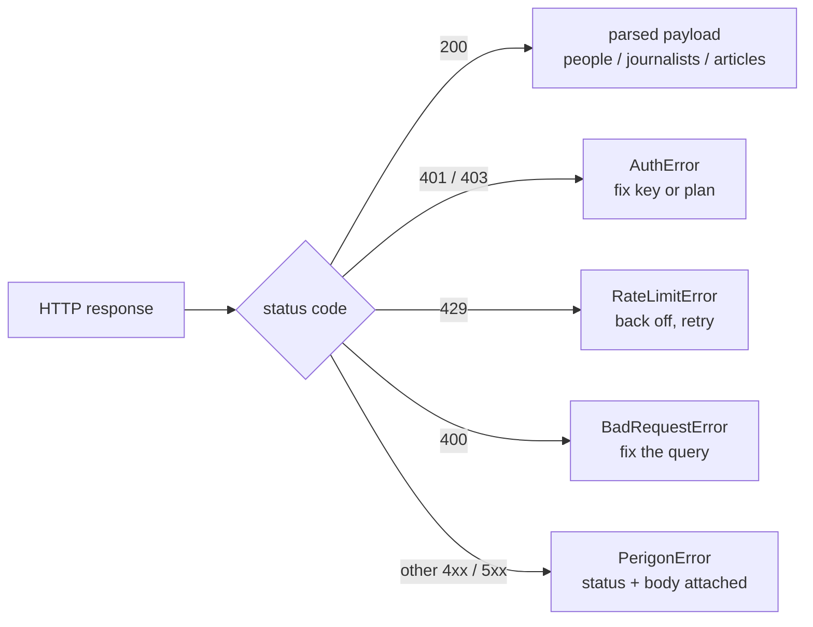

# People and Journalists API Python Examples: Resolve IDs, Then Filter Articles

Keyword search on a last name collides with photo captions, guest quotes, and every other person who shares the string. Stable coverage watches on a **news API** need **IDs**: a Wikidata ID when someone is **mentioned**, a journalist ID when someone **wrote** the piece. This repo is a clone-and-run **journalists API** / **people API** Python package for that pipeline on Perigon: look up People or Journalists, store the ID, then **filter articles by person** (`personWikidataId`) or **filter articles by journalist** (`journalistId`).

When you evaluate the **best news APIs** for production monitoring, ask whether the vendor supports stable person mentions and byline filters - not only keyword `q`. Entity IDs keep CEO mention feeds and reporter byline feeds from drifting when names collide. Company ticker / domain search is a sibling pattern; narrative velocity after you have a clean lane is a separate workflow - both are linked under Related reading.

It answers four practical questions:

1. How do I resolve a public figure to `personWikidataId` from Python (**news API by person**)?
2. How do I resolve a reporter to `journalistId` (**news API by journalist** / find reporters API)?
3. When should I filter mentions vs bylines (**mentioned vs wrote**)?
4. How do I wire both lookups into Articles without inventing IDs by hand?

---

## Quickstart

```bash
git clone https://github.com/Inekss/people-journalists-api-python-examples.git
cd people-journalists-api-python-examples
pip install -r requirements.txt
cp .env.example .env        # put your PERIGON_API_KEY inside
python main.py
```

You need a Perigon API key (free trial available - see [API plans](https://perigon.io/products/pricing/apis)). The key is read from `PERIGON_API_KEY` (environment or `.env`) and sent as an `x-api-key` header - never in the URL.

`main.py` runs both examples and prints JSON: People → Articles by `personWikidataId`, then Journalists → Articles by `journalistId`.

---

## Mentioned vs wrote (pick the right ID)

| You want… | Lookup surface | Store this | Articles filter | Meaning |
|-----------|----------------|------------|-----------------|---------|
| Coverage **about** a person | People (`/v1/people/all`) - people API news search | `wikidataId` | `personWikidataId` | Entity mention in the article |
| Pieces a reporter **wrote** | Journalists (`/v1/journalists/all`) - journalists API | `id` | `journalistId` | Matched byline / author link (**byline filter news API**) |

Do not use People IDs for bylines, and do not use journalist IDs for “was this CEO mentioned?” Those are different graphs on the same news index. Full journalist param depth lives in the Journalists API guide when you need beat / activity cookbooks; this repo stops at **name resolve → Articles**.

The whole pipeline, including the decision this repo automates:



Resolve happens once (left half); the stored ID is reused on every Articles call after that (right half). Optional `q`, dates, and `sourceGroup` narrow the feed only after the ID gate.

---

## Repo layout

```
people-journalists-api-python-examples/
  main.py                   # entry point: both resolve examples, print JSON
  perigon_examples/
    client.py               # PerigonClient - session, auth header, error mapping
    errors.py               # PerigonError, AuthError, RateLimitError, BadRequestError
    queries.py              # PeopleQuery, JournalistQuery, ArticleByEntityQuery
    people.py               # PeopleEndpoint.search()
    journalists.py          # JournalistsEndpoint.search()
    articles.py             # ArticlesEndpoint.search() for ID filters
    examples.py             # ResolvePersonExample, ResolveJournalistExample
```

Same OOP shape as the keyword/Summarize examples repo: one shared client, one class per endpoint, dataclasses for params, thin `main.py`.

---

## Journalists API and People API Python examples

`PerigonClient` owns one `requests.Session`, injects the API key, and maps status codes to typed exceptions. Endpoint classes stay thin - a practical **journalist API example** and **people API Python** resolve in the same style:

```python
from perigon_examples import PerigonClient, PeopleQuery, ArticleByEntityQuery
from perigon_examples.people import PeopleEndpoint
from perigon_examples.articles import ArticlesEndpoint

with PerigonClient() as client:
    people = PeopleEndpoint(client).search(PeopleQuery(name="Satya Nadella", size=5))
    person = people.people[0]
    articles = ArticlesEndpoint(client).search(
        ArticleByEntityQuery(
            person_wikidata_id=person.wikidata_id,
            size=3,
            sort_by="date",
            show_num_results=True,
        )
    )
    print(person.wikidata_id, articles.num_results, articles.articles[0].title)
```

Always take the ID from a live lookup (or a value you previously stored from one). Do not invent Wikidata IDs or journalist UUIDs in application code. Prefer the official SDK when you want typed models instead of raw HTTP (see Official Python SDK below).

What one `main.py` run does on the wire - the journalist lane is identical with `JournalistQuery` and `journalistId`:



One `PerigonClient` carries the session, auth header, and error mapping for every endpoint; the endpoint classes only build paths and parse rows.

---

## People search parameters (GET /v1/people/all)

`PeopleQuery` in [perigon_examples/queries.py](perigon_examples/queries.py) covers a practical starter set for **news people search API** resolve.

| Param | Description |
|-------|-------------|
| `name` | Exact-ish person name lookup (preferred for resolve) |
| `q` | Broader keyword-style people search when name alone is too narrow |
| `size` / `page` | Results per page and page number |
| `showNumResults` | Include total match count |

Response rows include `wikidataId`, `name`, `description` / `abstract`, and occupation metadata. Pass `wikidataId` to Articles as **`personWikidataId`**. Entity field semantics: [Entities docs](https://perigon.io/docs/api/entities).

---

## Journalists search parameters (GET /v1/journalists/all)

`JournalistQuery` covers **journalists API Python** name resolve plus a few discovery filters - not every Journalists parameter. Use this to **resolve journalist id**, then pin Articles.

| Param | Description |
|-------|-------------|
| `name` | Reporter name resolve (preferred for this repo's examples) |
| `q` | Keyword / boolean over journalist profiles |
| `topic` / `category` | Beat-style filters (e.g. `Politics`, `Tech`) |
| `source` | Publisher domain, e.g. `nytimes.com` |
| `country` | Two-letter country codes |
| `label` | Profile/content labels when available |
| `minMonthlyPosts` / `maxMonthlyPosts` | Activity band |
| `size` / `page` / `showNumResults` | Pagination and total count |

Response rows include `id` (the **journalistId**), `name`, `title`, `avgMonthlyPosts`, `topSources`, `topTopics`, and social URLs when present. Pass `id` to Articles as **`journalistId`**.

For beat discovery rosters (who covers Big Tech, elections, sports), start from a list post such as [Top tech journalists](https://perigon.io/blog/top-tech-journalists), then pin IDs the same way this repo does.

---

## Articles-by-ID parameters (GET /v1/all)

`ArticleByEntityQuery` is Articles search scoped to entity IDs - the **journalistId news API** and **personWikidataId** filters. Optional keyword / source / date fields refine the lane after the ID is set.

| Group | Param | Description |
|-------|-------|-------------|
| Person mentions | `personWikidataId` | One or more Wikidata IDs from People search |
| Bylines | `journalistId` | One or more journalist profile IDs |
| Keywords | `q` | Optional boolean keyword on top of the ID filter |
| Dates | `from` / `to` | ISO dates or datetimes (dataclass field: `from_`) |
| Sources | `source` / `sourceGroup` | Domains or curated packs |
| Locale | `language` / `country` | Two-letter codes |
| Shape | `size` / `page` / `sortBy` / `showNumResults` | Page shape and ordering |

Keyword-first Articles search (boolean `q` without an entity ID) and Summarize wiring live in the sibling keyword examples repo (see Related reading). After the ID lane is clean, monitor story momentum with the breaking-news guide linked below.

---

## Design notes

- **Resolve once, reuse the ID.** Lookups can return namesakes; inspect `description` / `title` / `topSources`, then store the chosen ID in your config or database.
- **One client, many endpoints.** Auth, timeouts, and error mapping live once. People, Journalists, and Articles are thin path wrappers.
- **Params as dataclasses.** `main.py` echoes `to_params()` next to results so the wire shape stays visible while you debug.
- **Typed errors at the boundary.** 401/403 → `AuthError`, 429 → `RateLimitError`, 400 → `BadRequestError`.

---

## Example output (trimmed)

Live shapes change; IDs below were resolved from name lookups (do not hard-code without re-checking).

```json
=== Resolve person -> Articles (personWikidataId) ===
{
  "example": "resolve_person",
  "person": {
    "name": "Satya Nadella",
    "wikidata_id": "Q7426870",
    "description": "Indian-American business executive and CEO of Microsoft"
  },
  "article_params": {
    "personWikidataId": "Q7426870",
    "size": 3,
    "sortBy": "date",
    "showNumResults": "true"
  },
  "num_results": 134286,
  "articles": [
    { "title": "…", "source": "enewstoday.co.kr", "pub_date": "2026-07-26T01:19:13+09:00" }
  ]
}

=== Resolve journalist -> Articles (journalistId) ===
{
  "example": "resolve_journalist",
  "journalist": {
    "name": "Maggie Haberman",
    "journalist_id": "b7cc246d2e7a470a90b81f3d4ccad2ca",
    "title": "Senior Political Correspondent, The New York Times",
    "avg_monthly_posts": 47,
    "top_sources": ["nytimes.com", "seattletimes.com", "azdailysun.com"]
  },
  "article_params": {
    "journalistId": "b7cc246d2e7a470a90b81f3d4ccad2ca",
    "size": 3,
    "sortBy": "date",
    "showNumResults": "true"
  },
  "num_results": 4743,
  "articles": [
    {
      "title": "El cambio de avión de Trump…",
      "source": "infobae.com",
      "authors_byline": "Maggie Haberman, Tyler Pager, Julian E. Barnes"
    }
  ]
}
```

---

## Errors and rate limits

| Status | Exception | Typical cause | What to do |
|--------|-----------|---------------|------------|
| 401 / 403 | `AuthError` | Missing/invalid key, or endpoint not on your plan | Check `.env`; compare [API plans](https://perigon.io/products/pricing/apis) |
| 429 | `RateLimitError` | Too many requests | Back off and retry with delay |
| 400 | `BadRequestError` | Malformed query | Message includes the server's explanation |
| Other 4xx/5xx | `PerigonError` | Anything else | Status code and body are on the exception |

How `PerigonClient` maps every response before your code sees it:



Empty People / Journalists results are not HTTP errors - the examples return an `error` field in the JSON payload so you can adjust the name or add filters.

---

## Official Python SDK (when to upgrade)

These examples use raw HTTP on purpose - every param, header, and status code is visible. For production services, install the official client from [goperigon/perigon-python](https://github.com/goperigon/perigon-python) (also on [PyPI perigon](https://pypi.org/project/perigon)): Pydantic-typed responses, sync + async methods, and models generated from the same OpenAPI spec. Language choice and architecture tradeoffs live in the [Perigon SDK overview](https://perigon.io/blog/perigon-sdk-overview-official-client-libraries-for-the-news-api); install and package names are in the [SDK docs](https://perigon.io/docs/api/perigon-sdks).

```bash
pip install perigon
```

```python
from perigon import ApiClient, V1Api

api = V1Api(ApiClient(api_key="YOUR_API_KEY"))
people = api.search_people(name=["Satya Nadella"], size=5)
articles = api.search_articles(person_wikidata_id=["Q7426870"], size=3)
# Bylines: api.search_articles(journalist_id=["<id from search_journalists>"])
```

Prefer the SDK when you want IDE autocompletion, typed models, and async fan-out. Prefer raw HTTP when you are learning the surface, debugging a request, or keeping dependencies minimal.

---

## Related reading

| If you need… | Read |
|--------------|------|
| Company / ticker / domain mention filters | [Company news API ticker search guide](https://perigon.io/blog/company-news-api-ticker-search-guide) |
| Breaking coverage and news-trend velocity | [Breaking news API: monitor news trends](https://perigon.io/blog/breaking-news-api-monitor-news-trends) |
| People / company / journalist field semantics | [Entities docs](https://perigon.io/docs/api/entities) |
| Beat discovery roster (then pin IDs here) | [Top tech journalists](https://perigon.io/blog/top-tech-journalists) |
| Keyword Articles + Summarize Python wiring | [news-api-python-examples](https://github.com/Inekss/news-api-python-examples) |
| Official typed Python client | [goperigon/perigon-python](https://github.com/goperigon/perigon-python) |
| Multi-language SDK decision | [Perigon SDK overview](https://perigon.io/blog/perigon-sdk-overview-official-client-libraries-for-the-news-api) |
| Vendor shortlist (best news APIs compare) | [Best news APIs in 2026](https://perigon.io/blog/best-news-apis-in-2026) |

---

## Key takeaways

- **Mentioned** → People → `personWikidataId`. **Wrote** → Journalists → `journalistId`. Mixing them produces the wrong feed.
- Resolve by name (or beat filters), confirm the profile, store the ID, then filter Articles - never invent IDs.
- Optional `q`, dates, and `sourceGroup` refine a lane *after* the ID gate, not instead of it.
- Keep the API key in an `x-api-key` header from the environment, never in code or URLs.
- Client / endpoint / query split matches the keyword examples repo; upgrade to the official Python SDK when you outgrow raw HTTP.
